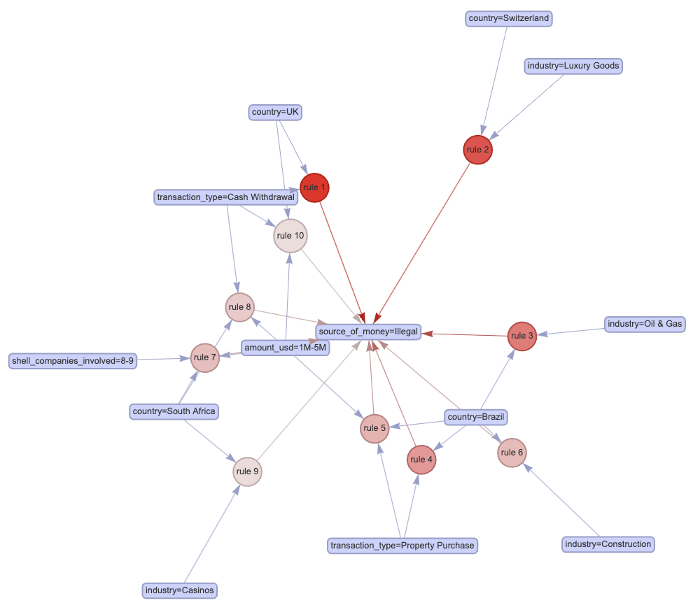
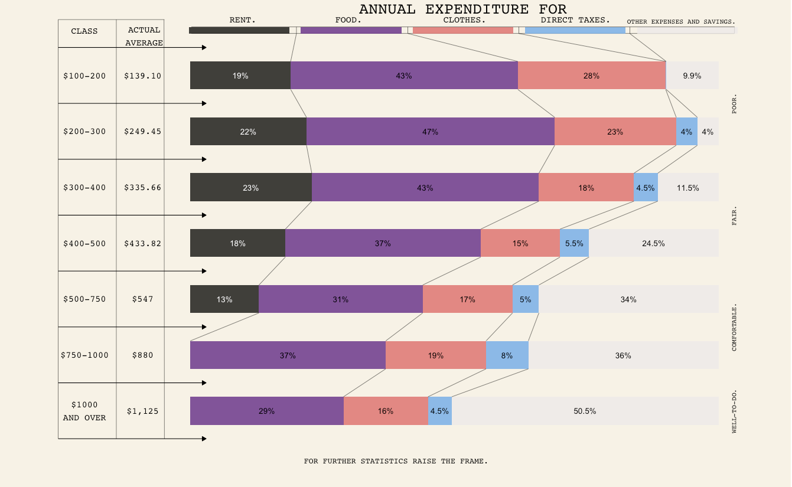
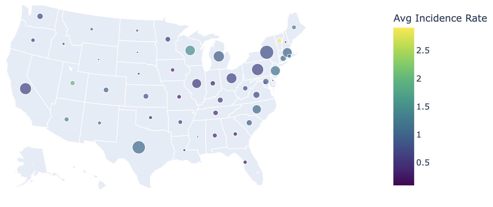

# Portfolio

#### If desired, select a language to jump to a section, then select a project to visit the associated GitHub repository where you'll find deliverables, code documentation, datasets, and more.
*Note: Projects are listed in reverse chronological order by date of completion.*

<!-- Navigation Links -->

  <a href="#python-projects" style="padding: 10px; background-color: #4CAF50; color: white; text-decoration: none; border-radius: 5px; margin: 10px;">Python</a>
  <a href="#r-projects" style="padding: 10px; background-color: #2196F3; color: white; text-decoration: none; border-radius: 5px; margin: 10px;">R</a>

<!-- R Projects Section -->

  <h2 style="text-align: center;">R Projects</h2>

  <!-- First Project -->
  

    <h3 style="margin-bottom: 10px;">
      <a href="https://github.com/BryanJacobs02/info523-final-project" style="color: inherit; text-decoration: none;">
        Identifying Characteristics of Suspicious Transactions Using Association Rule Mining and Time Series Anomaly Detection
      </a>
    </h3>
    
    <figcaption style="color: #808080; font-size: 14px; margin-top: 5px;">Completed: December 2024</figcaption>
  

  

  <!-- Second Project -->
  

    <h3 style="margin-bottom: 10px;">
      <a href="https://github.com/BryanJacobs02/data-visualization-assignments" style="color: inherit; text-decoration: none;">
        Data Visualization Practice / Progression
      </a>
    </h3>
    
    <figcaption style="color: #808080; font-size: 14px; margin-top: 5px;">Completed: November 2024</figcaption>
  

<!-- Python Projects Section -->

  <h2 style="text-align: center;">Python Projects</h2>

<!-- First Project -->
  

    <h3 style="margin-bottom: 10px;">
      <a href="https://github.com/BryanJacobs02/seasons-of-sickness" style="color: inherit; text-decoration: none;">
        Mapping the Seasons of Sickness: Geographic and Seasonal Trends in U.S. Disease Incidence
      </a>
    </h3>
    
    <figcaption style="color: #808080; font-size: 14px; margin-top: 5px;">Completed: December 2024</figcaption>
  

  

