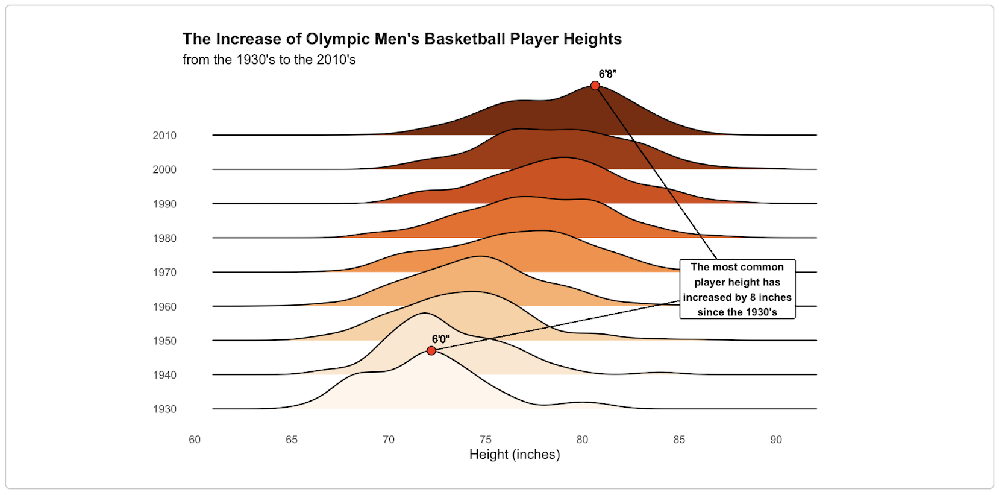

  <h1 style="margin: 0;">Portfolio</h1>
  <a href="mailto:bryanj82202@gmail.com" 
     style="padding: 8px 16px; background-color: #0366d6; color: white; text-decoration: none; border-radius: 5px; font-size: 14px;">
    Contact Me
  </a>

  <em>Select a project to visit the associated GitHub repository where you'll find deliverables, code documentation, datasets, and more.</em>

    <h3 style="margin-bottom: 10px;">
      <a href="https://github.com/BryanJacobs02/sunyac-sports-ranking" style="color: inherit; text-decoration: none;">
        SQL Database Design for a Hospital System
      </a>
    </h3>
    
    <figcaption style="color: #808080; font-size: 14px; margin-top: 5px;">Completed: October 2025</figcaption>
    

    <strong>Tools & Techniques:</strong> MySQL, ER Modeling, Database Design
  

  

  

 

  <h3 style="margin-bottom: 10px;">
    <a href="https://github.com/BryanJacobs02/hpc-optimization" style="color: inherit; text-decoration: none;">
      RNA-Seq Pipeline Optimization in Murine Colon Crypts
    </a>
  </h3>
  
  <figcaption style="color: #808080; font-size: 14px; margin-top: 5px;">Completed: May 2025</figcaption>
  

    <strong>Tools & Techniques:</strong> RNA-seq pipeline, R, Bash (Shell Scripting), SLURM (Job Scheduler), Unix/Linux (HPC Systems)
  

 

  <h3 style="margin-bottom: 10px;">
    <a href="https://github.com/BryanJacobs02/seasons-of-sickness" style="color: inherit; text-decoration: none;">
      Mapping the Seasons of Sickness: Geographic and Seasonal Trends in U.S. Disease Incidence
    </a>
  </h3>
  
  <figcaption style="color: #808080; font-size: 14px; margin-top: 5px;">Completed: December 2024</figcaption>
  

    <strong>Tools & Techniques:</strong> Python, VS Code (Jupyter Notebook Extension), Multivariate Logistic Regression, Geospatial Visualization, Time Series Analysis
  

  

  

    <h3 style="margin-bottom: 10px;">
      <a href="https://github.com/BryanJacobs02/info523-final-project" style="color: inherit; text-decoration: none;">
        Identifying Characteristics of Suspicious Transactions Using Association Rule Mining and Time Series Anomaly Detection
      </a>
    </h3>
    
    <figcaption style="color: #808080; font-size: 14px; margin-top: 5px;">Completed: December 2024</figcaption>
    

    <strong>Tools & Techniques:</strong> R, R Markdown, Association Rule Mining, Time Series Anomaly Detection
  

  

  

   

  <h3 style="margin-bottom: 10px;">
    <a href="https://github.com/BryanJacobs02/visualizing-the-olympics" style="color: inherit; text-decoration: none;">
      Visualizing The Olympics
    </a>
  </h3>
  
  <figcaption style="color: #808080; font-size: 14px; margin-top: 5px;">Completed: December 2024</figcaption>
  

    <strong>Tools & Techniques:</strong> R, Quarto, Logistic Regression, Time Series Analysis, Density Plots
  

  

    <h3 style="margin-bottom: 10px;">
      <a href="https://github.com/BryanJacobs02/data-visualization-assignments" style="color: inherit; text-decoration: none;">
        Data Visualization Practice / Progression
      </a>
    </h3>
    
    <figcaption style="color: #808080; font-size: 14px; margin-top: 5px;">Completed: November 2024</figcaption>
    

    <strong>Tools & Techniques:</strong> R, Quarto Markdown, Data Visualization/Storytelling 
  

  

    <h3 style="margin-bottom: 10px;">
      <a href="https://github.com/BryanJacobs02/sunyac-sports-ranking" style="color: inherit; text-decoration: none;">
        Sports Rankings Using a Minimum Violations Method
      </a>
    </h3>
    
    <figcaption style="color: #808080; font-size: 14px; margin-top: 5px;">Completed: May 2024</figcaption>
    

    <strong>Tools & Techniques:</strong> R, MVR Method, Linear Algebra, Heatmaps, 3D Surface Plots
  

  

    <h3 style="margin-bottom: 10px;">
      <a href="https://github.com/BryanJacobs02/reflection-ray-tracer" style="color: inherit; text-decoration: none;">
        Reflection in a Ray Tracer
      </a>
    </h3>
    
    <figcaption style="color: #808080; font-size: 14px; margin-top: 5px;">Completed: December 2023</figcaption>
    

    <strong>Tools & Techniques:</strong> Python, Recursive Ray Tracing, Reflection Vector Calculations, Shading and Lighting Models
  

  

    <h3 style="margin-bottom: 10px;">
      <a href="https://github.com/BryanJacobs02/modeling-reef-bleaching" style="color: inherit; text-decoration: none;">
        Modeling Coral Reef Bleaching
      </a>
    </h3>
    
    <figcaption style="color: #808080; font-size: 14px; margin-top: 5px;">Completed: May 2023</figcaption>
    

    <strong>Tools & Techniques:</strong> R, Equilibrium and Stability Analysis, Sensitivity Analysis, Simulations Over Time, Lotka-Volterra Competition Equations
  

  

